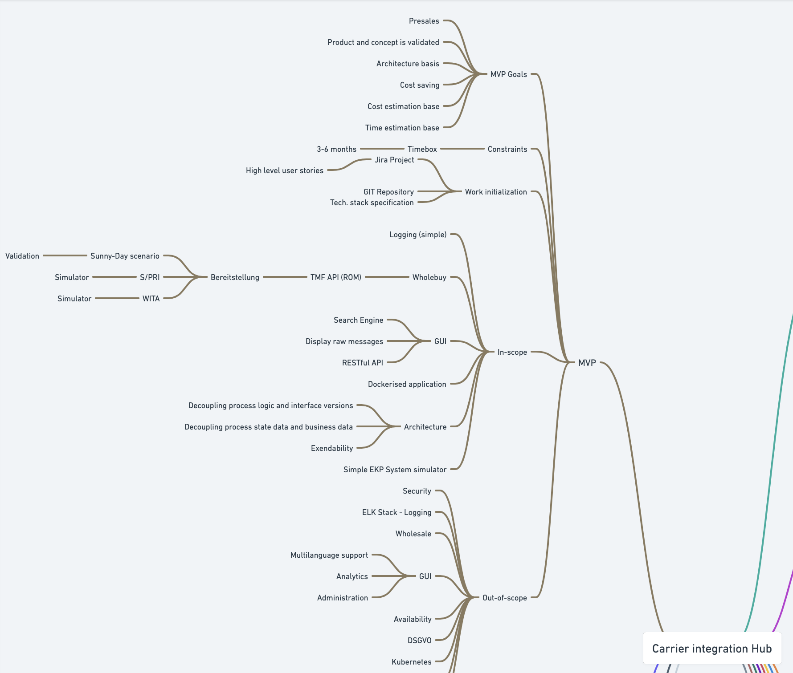
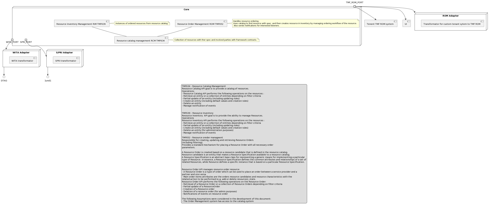

# Adlatus

## Background

Bitconex wants to deliver a product to the telco industry market.

Product will be a system for support of ordering resources in a telecommunications company (telco).

The term: Product, System, Adlautus will be used interchangably.

Resources are physical or non-physical components (or some combination of these) within an enterprise's infrastructure or inventory. 
Non-Physical for example a leased optical line, capacity of disk storage, physical like device or port on device, SIM card.

System acts as a hub for existing resource system of an telco and other parties that are invoved in trading/ordering of resouces.

It can also act as resources system for clieant by itself (as catalog and inventory), if the client doesn't have any existing resource management system, with his supporting systems (Party, Location mgm).

System support standards that are used for Resource Order Management like:

1. Resource order management TMF652 (ROM),
2. Resource catalog management TMF634 (RCM)
3. Resource inventory management TMF639 (RIM)  

and also existing trading standards:
1. WITA and
2. S/PRI.

**TMF stands for TM (TeleManagement) Forum**
TM Forum is a global industry association for service providers and their suppliers in the telecommunications industry.

https://www.tmforum.org/code-frameworks/

**WITA OSS (Wholesale IT Architektur OrderSchnittStelle)**
Network operators often have to use leased subscriber lines  from Deutsche Telekom AG (DTAG) The exchange of information on the leasing, management and fault clearance of the local loop will take place via DTAG's WITA interface.

**S/PRI**

A uniform interface on the market for handling the ordering and management of end-customer lines and specifies the use of the "S/PRI" interface for this purpose.

https://ak-spri.de/spri/spri-spezifikationen-2-2/

System is single-tenant, and should act as support for ordering (buying/selling) resources by the existing financial framework contract between the parties.

Parties are telcos that buy resources, and also sell a resource to other telco, so depending of their role thay can be Consumer (AKA Buyer) and Provider (AKA Seller).

System can be logicaly divided in two parts depending of the direction or action (Consuming or Providing).

System should be deployed on prem or on cloud infrastructure.

Integration to existing systems (on the tenant side) come in next types:

1. TMF compliant ROM system
2. Resource catalog, inventory and UI for tenants without their software, we provide supporting systems.
3. Integration from custom to TMF ROM standard

Integration to other systems (on the provider side):

1. WITA interface to DTAG
2. S/PRI interface to other telcos.

## MVP Minimum viable product

MVP will be designed so that client will be a Consumer, it will implement core system (catalog, inventory and management of resources by TMF) 
with simple UI to view and handle data in catalog, inventory and manage order. 
It will support buying resources to DTAG in most simple happy path scenario using WITA interface/standard.

Mind map with MVP -> https://whimsical.com/spri-CuiovSvMgvFyD1DHQMFCwZ

- Ticketing system (Jira) : https://bitconex.atlassian.net/jira/software/projects/ADL/boards/17
- Source code (Bitbucket): https://bitbucket.org/bitconex/workspace/repositories/?project=%7B6dbda8d0-515d-4897-967d-1677a370dbcc%7D 

## Core system and arch.

[UML](http://www.plantuml.com/plantuml/png/xLVDRjj64BxpAGO-9O2j8lqfK1-A20hQ-f3Oi1Nqa1h1Q3cI5bdk4hjB2KRHT-yCHroIiOmMFJS8BExip3V_dwYtAMFCNUCg7sg2YrM8T05_LW2VxYc5BXg2srXJXFVeSKSD-Gptj-zX_VwN7t_uzX6Jd5ZTXqmGxMwV8Mn5TWs_eQyT9OW3K10WwtUBF_p7n1S6CxgmWnnWQtqzAXvjtaDgoIm0MPxtvC54mZn5ivx_7yZd49zWymID1CZenGqSG_ooTU784Gb6CMN_i7GfG29V9mdTRYq7OuDFi0sHSJEnSgOQdEKFJp4j0A2QrUMcU9_MvaPhyzrFZu19ZjMyDYAwPjkKqHjABD60QSoVWuYXASUXJkoy6jsNwZKJvwkJy-_L-UfCPrRiVHMS8oFvYgYurRfpfM9VVAczb3Yu0zNGOinsqDb6R4ZA2oRu7D7ajEZ3ayvVNQbZJdHuR4FCeSlm-yrw-VdkzduzaJtStTzCPTPB3fyPIAL_LQVP56DOrjXcYXU0IT6MxtHS-ziSqIVkO8CvnCVHzE4RTZAp5Q_5LWvVsHQTzVtomyE8n67DSFZCC3tAUWhGpv7fKkP6PlBeCwIdJ7m8afxOYO-IwkhZmveNYVrKdqvvFSBLrSzmyMwz_FMYwcCSXMywNx-vg4HxMYozrPZEt72CvCdd8G8EAN5CZsTLFzuy3h4KwL1o3MUK3-NaU1pjoDULZY5SGPdNbSxhP5cgPtVBknlO1NHWanIgZU5WQm8impuTrqLrsrBKjRskhk0i6cj8Ir9F0DlWc0vwZYYM4FoC718eLewM3WJeWNos-Gb2b3YccwCtiXGrjPnq3-oPoroc22PQ_h38Q7UoE-YWQslC99OZx2lhZUl4Lg_b8NQEqcisNFMaTrwxfYrsBiC1NKT9bbKvKc8h0E_8qHI0HLh_mdeb5o6pn0rKzYgTcn5TTKRsKjEagBYnZhsAM6cgWAO5JDft3hTqx__kZG32AbWtrjkKesgtNMn3OeD_xgr-QKzR6oBL54_DEQraotMr6qTAOP7wh2x7_2JMg1MMu_mz8LMJ9BMM_FHwKTtfM2H0I9aXCDRGaDaZfzBqhbg7fiV_2bA_Sj0vy6Ge9OpSJhceMepO4BkGQQgMNzlPfE5J3HjCL4jxSVgroatlMvhtc4MRcs8zwzdvK0timqxkdnlRD3P8aHhyGccQnaDBPcm87j0wb0Bd0FZSYoHotb9TuKPwRtAV51Y7ITzQ8hMCHLwR14p35As1Xd1uhMbQHysWeD_efdCOg_pKoc0NlmlUGw34O8OkNyv4wwNRQKBJI78vHxlfyccc8pbTrBrjatX0I9JveUflg2xGwHAEU-ke20ewcvoyWjNNfjAnqjTPEY-4kwYW_rTLypaHfj4DUFQoMex2AkVc2s4edUfp2cOlmm4RWavYow4VRDbYrU6RV2JoVIdYmHeQA3Fs9SDACl6dKtz_e9YmNsyxWDXCJPfLE_QKgzVfp9HhGqRv7cM8ADh4PHlV_KfZK8ao1mvu868MlwB5xXgmheLIQoMemhwlBsMvCotEbFZVa_dSTaBew7I4vWhdk7skyLyela3q20ERC_pyLkizS7Mvde_HoDjpklum--LHY5fYd0CmTSzgjaofQrerEr8aCFma4pIILyrOBhIoxlhxH_Wjc4u4Kb86VFxBJjy7OOy9q0ZNGWviMhZff51nBU7qelUM_tID-ni0)

TODO:

1. Desing&implement core system - resource ordering domain

 - Resource Catalog Management - TMF 634 - V4.1.0
 - Resource Order Managment - TMF 
 - Resource Inventory Management - TMF 639 V4.0.0
 - Define and describe data model for framework contract between parties for Catalog management
 - 

2. Desing&implement supporting domains (systems):

 - Party Management - TMF 632 V4.0.0
 - Appointment - TMF 646 V4.0.0
 - GeoLocation - TMF 675 V4.0.0
 - Adlatus
 - UI

3. Design integration components  (adapters) & implement WITA happy path

 - describe data model mappings (REsource spec and DTAG products)
 - describe state mappings (TMF ROM WITA workflow)

4. Desing&Setup infra things:

 - CI/CD, deployment on cloud, dockerisation
 - Externalise configuration for all systems.
 - API Gateway for UI

