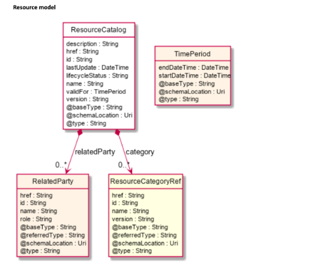
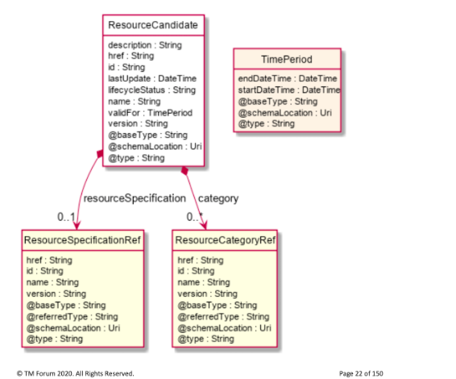
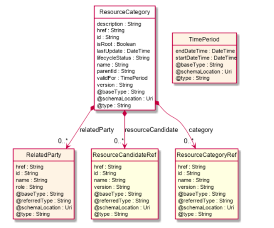
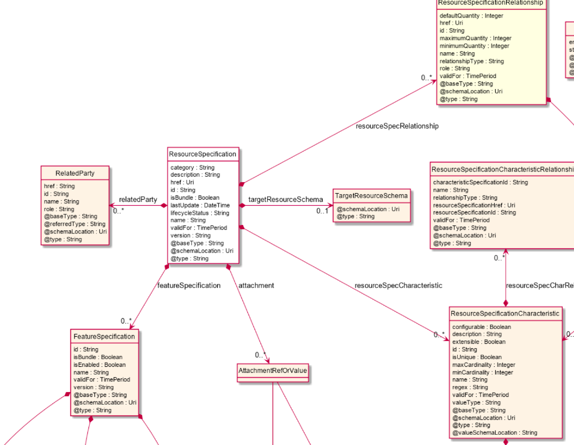
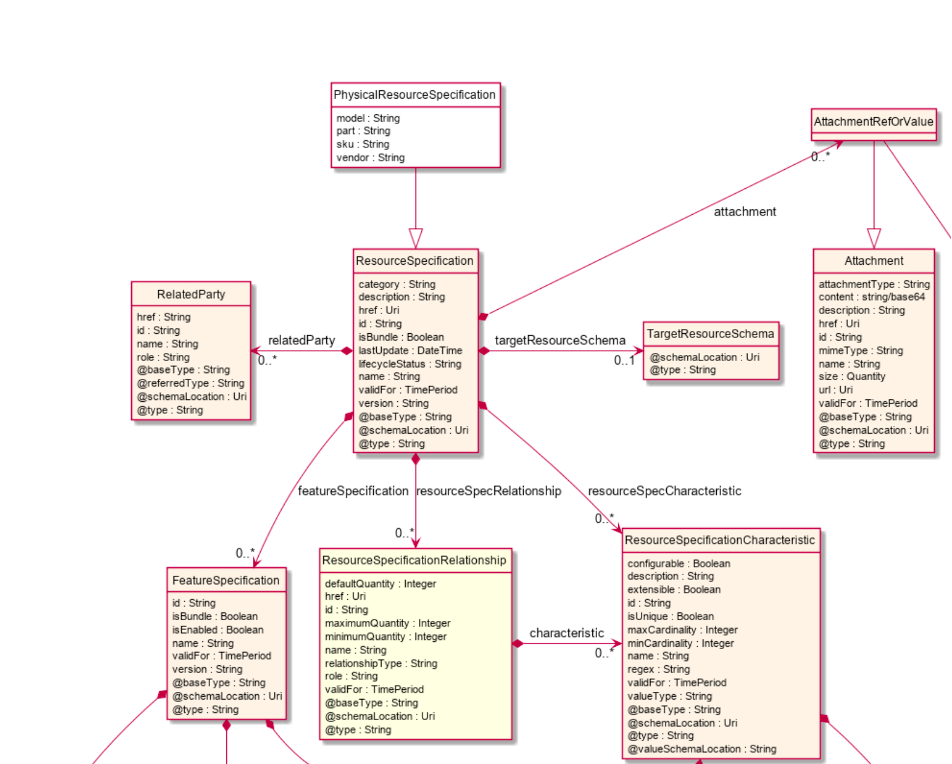
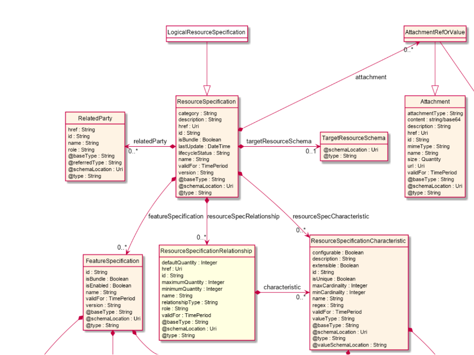

# Core

Core consist of 3 TMF standards and supporting models

1. TMF634 Resource Catalog Management v4.1.0
2. TMF652 Resource Order Management v4.0.0
3. TMF639 Resource Inventory Management v4.0.0

## Use cases of core

- User enters catalog
- User enters/selects cataloga and category
- User enters/selets resource specification

## Data model of TMF catalog

### Catalog

### Candidate

### Category

### Resource Specification

#### Physical Resource Specification

#### Logical Resource Specification

## Data model of TMF inventory

## Data model of TMF order management

## Workflow in TMF order management

## Mapping of TMF order management to WITA

